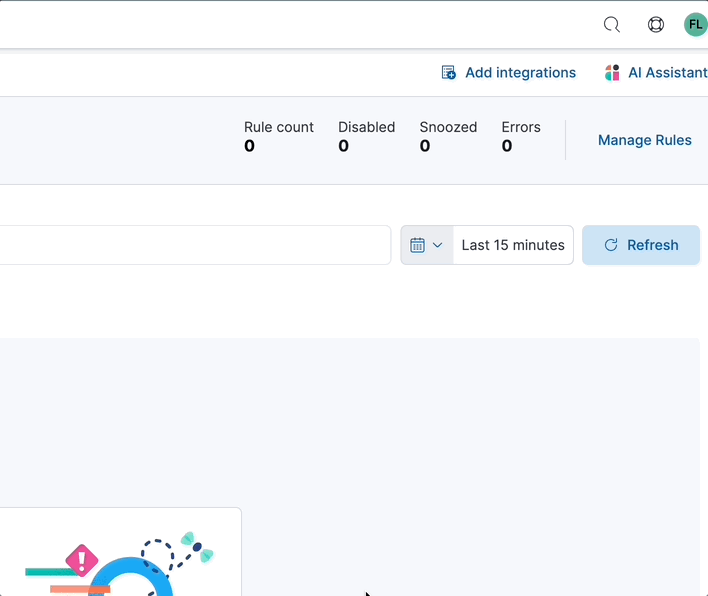
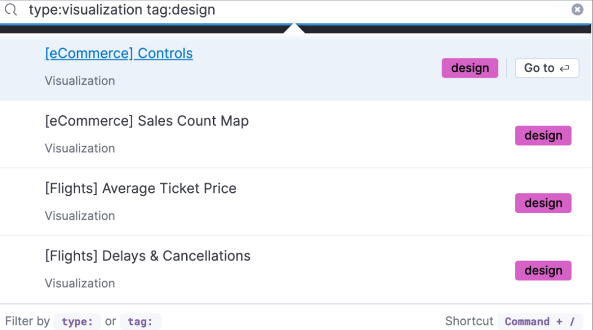

To find apps and any objects that you create in your project, a search is available at any time from the application header. Search suggestions let you navigate to applications or to the views you need most.

## Search for objects by type, name, and tag

<DocCallOut color="success" title="Tip" iconType="pin">
    Use the keyboard shortcut **Ctrl**+**/** on Windows and Linux or **Command**+**/** on MacOS to focus on the input at any time.
</DocCallOut>

**Search by type**

Example: `type:dashboard`

Available types: *application*, *canvas-workpad*, *dashboard*, *data-view*, *lens*, *maps*, *query*, *search*, *visualization*

**Search by tag**

Examples: `tag:mytagname` or `tag:"tag name with spaces"`

**Search by type and name**

Example: `type:dashboard my_dashboard_title`

**Advanced searches**

Examples: `tag:(tagname1 or tagname2) my_dashboard_title` 

`type:lens tag:(tagname1 or tagname2)` 

`type:(dashboard or canvas-workpad) logs`

This example searches for visualizations with the tag `design`:
`type:visualization tag:design`

