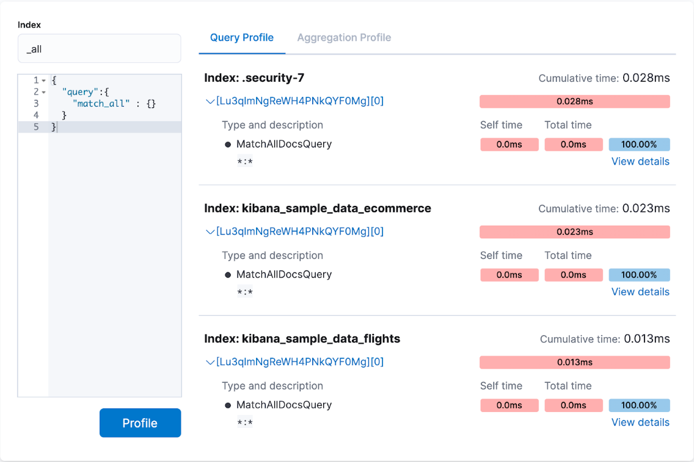
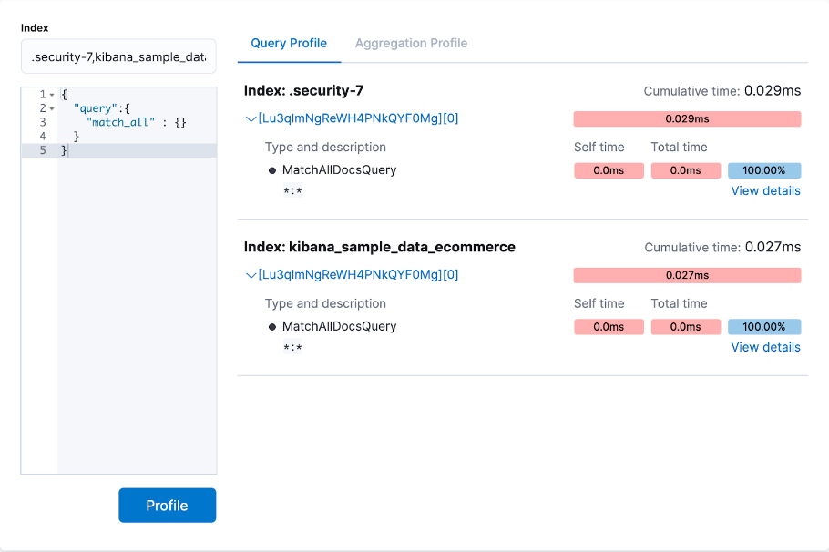
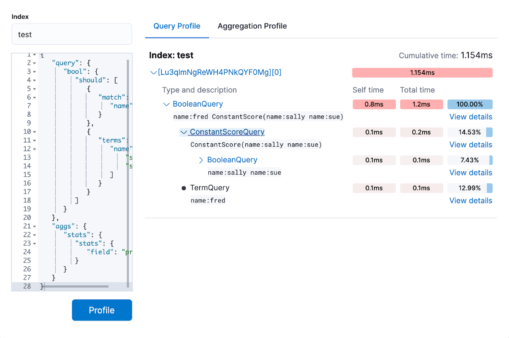
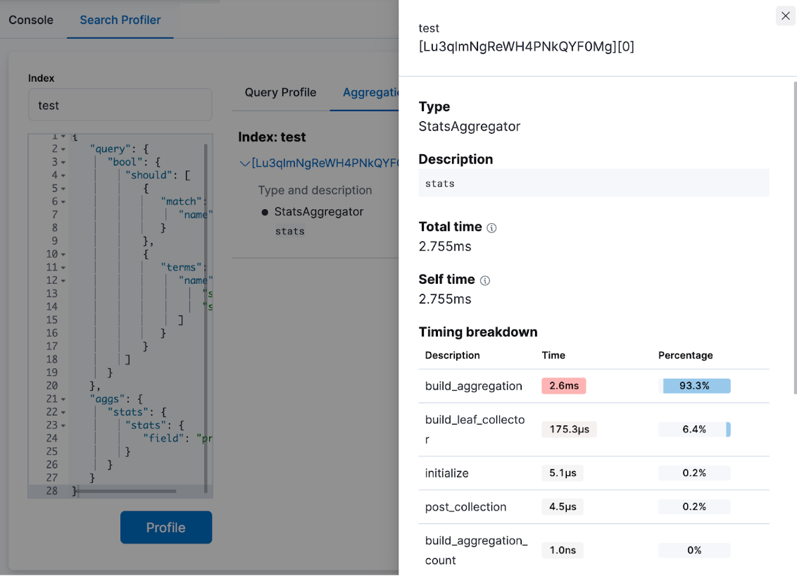
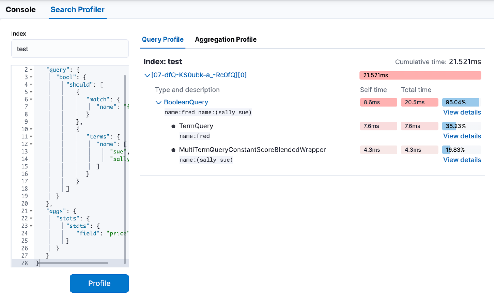

[Search Profiler](app/dev_tools#/searchprofiler) lets you diagnose and debug search queries to optimize them for better performance.

Elasticsearch has a powerful [Profile API](https://www.elastic.co/guide/en/elasticsearch/reference/current/search-profile.html) for debugging search queries. It provides detailed timing information about the execution of individual components in a search request. In practice, profile API responses can be hard to read. **Search Profiler** helps you visualize these responses in a graphical interface.


## How does it work?

When you profile a request, **Search Profiler** displays:

- The names of the indices searched.
- How long it took for the query to complete.
- Details about query components and the timing breakdown of low-level methods, that you can access by selecting View details.



## Query a specific index or type

By default, all queries executed by **Search Profiler** are sent to *GET /_search*. It searches across your entire cluster (all indices, all types). To query a specific index or type, you can use the Index filter.

You can specify several values using commas. For example, `.security-7,kibana_sample_data_ecommerce`. This is equivalent to making a request to `GET /.security-7,kibana_sample_data_ecommerce/_search`.




## Profile complex queries

To understand how the query trees are displayed inside Search Profiler, take a look at a more complex query.

1. Go to [Console](app/dev_tools#/console) and index the following data:

  ```
  POST test/_bulk
  {"index":{}}
  {"name":"aaron","age":23,"hair":"brown"}
  {"index":{}}
  {"name":"sue","age":19,"hair":"red"}
  {"index":{}}
  {"name":"sally","age":19,"hair":"blonde"}
  {"index":{}}
  {"name":"george","age":19,"hair":"blonde"}
  {"index":{}}
  {"name":"fred","age":69,"hair":"blonde"}
  ```

2. Now go to [Search Profiler](app/dev_tools#/searchprofiler) and enter `test` in the **Index** field to restrict profiled queries to the *test* index.

3. Replace the default *match_all* query in the query editor with a query that has two sub-query components and includes a simple aggregation:

  ```json
  {
    "query": {
      "bool": {
        "should": [
          {
            "match": {
              "name": "fred"
            }
          },
          {
            "terms": {
              "name": [
                "sue",
                "sally"
              ]
            }
          }
        ]
      }
    },
    "aggs": {
      "stats": {
        "stats": {
          "field": "price"
        }
      }
    }
  }
  ```

4. **Profile** the query and visualize the results.

  

  - The top **BooleanQuery** component corresponds to the bool in the query.
  - The second **BooleanQuery** corresponds to the terms query, which is internally converted to a boolean of should clauses. It has two child queries that correspond to sally and sue from the terms query.
  - The **TermQuery** that's labeled with name:fred corresponds to match: fred in the query.
  - In the time columns, the **Self time** and **Total time** are no longer identical on all rows:
    - **Self time** represents how long the query component took to execute.
    - **Total time** is the time a query component and all its children took to execute. Therefore, queries like the Boolean queries often have a larger total time than self time.

5. Select **Aggregation Profile** to view aggregation profiling statistics. This query includes a stats aggregation on the "age" field. The **Aggregation Profile** tab is only enabled when the query being profiled contains an aggregation.

6. Select **View details** to view the timing breakdown.

   

## Capture slow queries when they happen

Investigate temporal performance issues. For example, a query might only be slow at a certain time of day when many customers are using your system. 

You can set up a process to automatically profile slow queries when they occur and then save those profile responses for later analysis.

**Search Profiler** supports this workflow by allowing you to paste the pre-captured JSON in the query editor. **Search Profiler** detects when you enter a JSON response instead of a query and renders just the visualization, rather than querying the cluster.

To try it, **Profile** the following JSON response:

```
{
  "took": 3,
  "timed_out": false,
  "_shards": {
    "total": 1,
    "successful": 1,
    "failed": 0
  },
  "hits": {
    "total": 1,
    "max_score": 1.3862944,
    "hits": [
      {
        "_index": "test",
        "_type": "test",
        "_id": "AVi3aRDmGKWpaS38wV57",
        "_score": 1.3862944,
        "_source": {
          "name": "fred",
          "age": 69,
          "hair": "blonde"
        }
      }
    ]
  },
  "profile": {
    "shards": [
      {
        "id": "[O-l25nM4QN6Z68UA5rUYqQ][test][0]",
        "searches": [
          {
            "query": [
              {
                "type": "BooleanQuery",
                "description": "+name:fred #(ConstantScore(*:*))^0.0",
                "time": "0.5884370000ms",
                "breakdown": {
                  "score": 7243,
                  "build_scorer_count": 1,
                  "match_count": 0,
                  "create_weight": 196239,
                  "next_doc": 9851,
                  "match": 0,
                  "create_weight_count": 1,
                  "next_doc_count": 2,
                  "score_count": 1,
                  "build_scorer": 375099,
                  "advance": 0,
                  "advance_count": 0
                },
                "children": [
                  {
                    "type": "TermQuery",
                    "description": "name:fred",
                    "time": "0.3016880000ms",
                    "breakdown": {
                      "score": 4218,
                      "build_scorer_count": 1,
                      "match_count": 0,
                      "create_weight": 132425,
                      "next_doc": 2196,
                      "match": 0,
                      "create_weight_count": 1,
                      "next_doc_count": 2,
                      "score_count": 1,
                      "build_scorer": 162844,
                      "advance": 0,
                      "advance_count": 0
                    }
                  },
                  {
                    "type": "BoostQuery",
                    "description": "(ConstantScore(*:*))^0.0",
                    "time": "0.1223030000ms",
                    "breakdown": {
                      "score": 0,
                      "build_scorer_count": 1,
                      "match_count": 0,
                      "create_weight": 17366,
                      "next_doc": 0,
                      "match": 0,
                      "create_weight_count": 1,
                      "next_doc_count": 0,
                      "score_count": 0,
                      "build_scorer": 102329,
                      "advance": 2604,
                      "advance_count": 2
                    },
                    "children": [
                      {
                        "type": "MatchAllDocsQuery",
                        "description": "*:*",
                        "time": "0.03307600000ms",
                        "breakdown": {
                          "score": 0,
                          "build_scorer_count": 1,
                          "match_count": 0,
                          "create_weight": 6068,
                          "next_doc": 0,
                          "match": 0,
                          "create_weight_count": 1,
                          "next_doc_count": 0,
                          "score_count": 0,
                          "build_scorer": 25615,
                          "advance": 1389,
                          "advance_count": 2
                        }
                      }
                    ]
                  }
                ]
              }
            ],
            "rewrite_time": 168640,
            "collector": [
              {
                "name": "CancellableCollector",
                "reason": "search_cancelled",
                "time": "0.02952900000ms",
                "children": [
                  {
                    "name": "SimpleTopScoreDocCollector",
                    "reason": "search_top_hits",
                    "time": "0.01931700000ms"
                  }
                ]
              }
            ]
          }
        ],
        "aggregations": []
      }
    ]
  }
}
```

The output should look similar to this:

