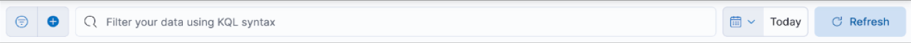
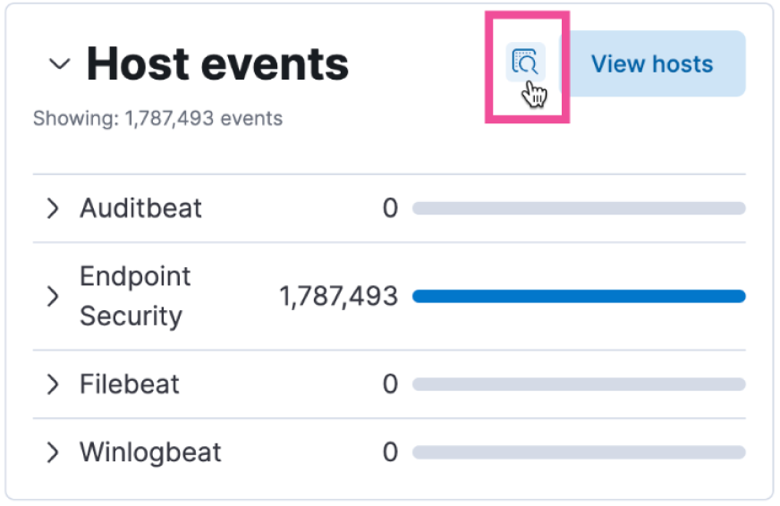
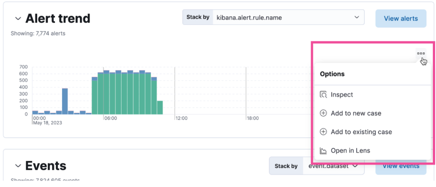
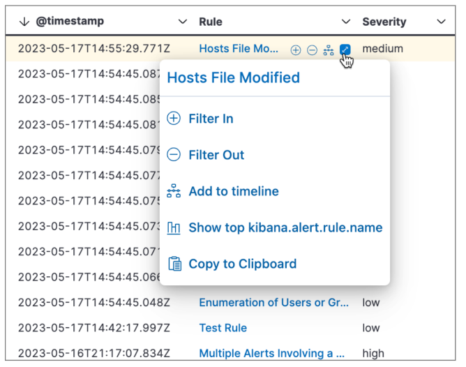
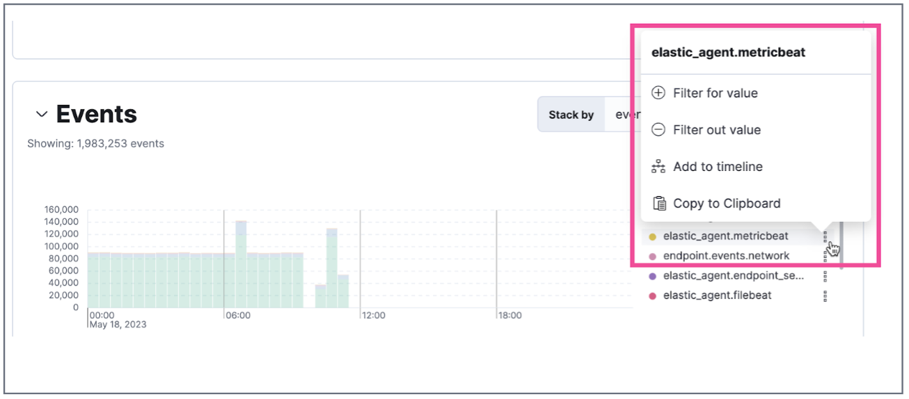

Elastic Security is a highly interactive workspace that provides a clear overview of events and alerts from your environment and lets you drill down into areas of interest.

## Data filters

Filter for alerts, events, processes, and other important security data by entering [Kibana Query Language (KQL)](https://www.elastic.co/guide/en/kibana/current/kuery-query.html) queries in the search bar, which appears at the top of each page. A time range filter set to Today is enabled by default.

To refine the search results, select **Add Filter**, then enter the field, operator (such as is not or is between), and the filter value.

<DocCallOut color="success" title="Tip" iconType="pin">
    You can save the KQL query and any applied filters to find it back quickly later.
</DocCallOut>

## Navigation menu

The navigation menu contains direct links and expandable groups, identified by the **Group** icon.

- Click a top-level link to go directly to its landing page, which contains links and information for related pages.
- Click a group icon to open its flyout menu, which displays links to related pages within that group. Click a link in the flyout to navigate to its landing page.
- Click the **Collapse side navigation** icon to collapse and expand the main navigation menu.

## Visualization actions

Many Elastic Security histograms, graphs, and tables display an **Inspect** button when you hover over them. Click to examine the Elasticsearch queries used to retrieve data throughout the app.

Other visualizations display an options menu, which allows you to inspect the visualization's queries, add it to a new or existing case, or open it in **Lens** for customization.

## Inline actions for fields and values

Hover over data fields and values to display inline actions, which allow you to customize your view or investigate further based on that field or value.

In some visualizations, these actions are available in the legend. 

<DocDefList>
    <DocDefTerm>Filter In </DocDefTerm>
    <DocDefDescription>Add a filter that includes the selected value.</DocDefDescription>

    <DocDefTerm>Filter Out </DocDefTerm>
    <DocDefDescription>Add a filter that excludes the selected value.</DocDefDescription>

    <DocDefTerm>Add to timeline</DocDefTerm>
    <DocDefDescription>Add a filter to Timeline for the selected value.</DocDefDescription>

    <DocDefTerm>Toggle column in table</DocDefTerm>
    <DocDefDescription>Add or remove the selected field as a column in the alerts or events table. (This action is only available on an alert's or event's details flyout.)</DocDefDescription>

    <DocDefTerm>Show top x</DocDefTerm>
    <DocDefDescription>Display a pop-up window that shows the selected field's top events or detection alerts.</DocDefDescription>
   
    <DocDefTerm>Copy to Clipboard </DocDefTerm>
    <DocDefDescription>Copy the selected field-value pair to paste elsewhere.</DocDefDescription>
</DocDefList>

## Accessibility features

Accessibility features, such as keyboard focus and screen reader support, are built into the Elastic Security UI. These features offer additional ways to navigate the UI and interact with the application.

### Interact with draggable elements

You can use your keyboard to interact with draggable elements.

- Press **Tab** to apply keyboard focus to an element within a table. Or, use your mouse to click on an element and apply keyboard focus to it.

- Press **Enter** on an element with keyboard focus to display its menu and press **Tab** to apply focus sequentially to menu options. The **f**, **o**, **a**, **t**, and **c** hotkeys are automatically enabled during this process and offer an alternative way to interact with menu options.

    

- Press the **spacebar** once to begin dragging an element to a different location and press it a second time to drop it. Use the **directional arrows** to move the element around the UI.

    

- When an event has an event renderer, press **Shift** and the **down directional arrow** to apply keyboard focus to the event renderer and **Tab** or **Shift + Tab** to navigate between fields. To return to the cells in the current row, press the **up directional arrow**. To move to the next row, press the **down directional arrow**.

### Keyboard navigation

Use your keyboard to navigate through rows, columns, and menu options in the Elastic Security UI.

- Use the **directional arrows** to move keyboard focus right, left, up, and down in a table.

- Press **Tab** to navigate through a table cell with multiple elements, such as buttons, field names, and menus. Pressing **Tab** will sequentially apply keyboard focus to each element in the table cell.

    

- Use **CTRL + Home** to shift keyboard focus to the first cell in a row. Likewise, use **CTRL + End** to move keyboard focus to the last cell in the row.

- Use the **Page Up** and **Page Down** keys to scroll through the page.